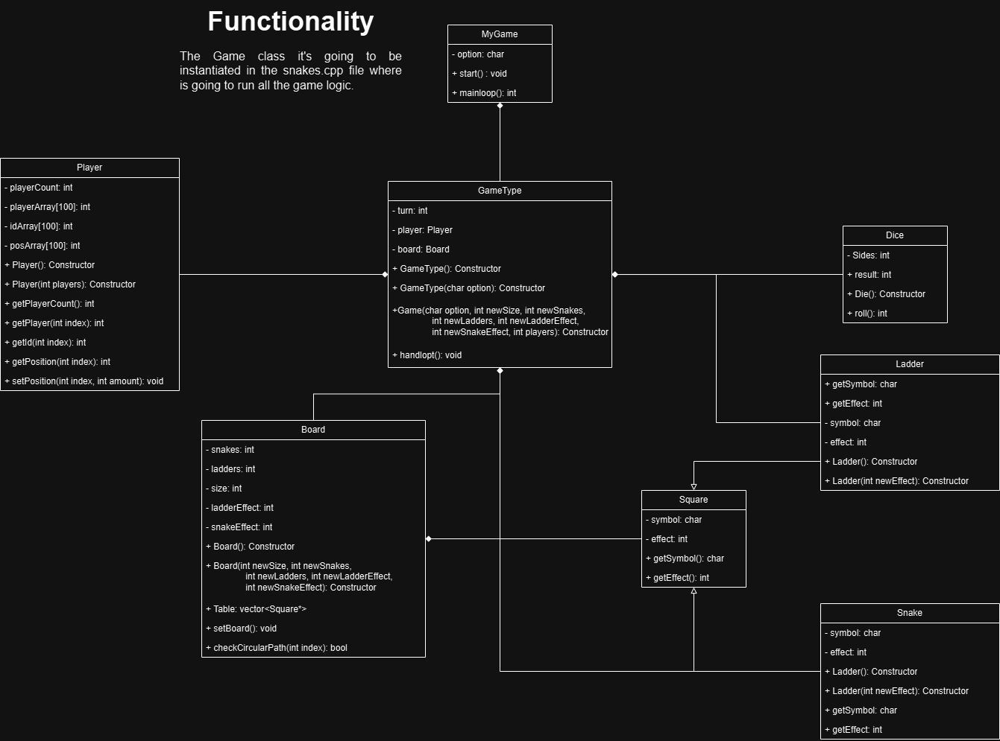

# Snake & ladders

The fundamental OOP concepts implemented in the project were the use of abstraction, encapsulation and composition. The architecture used within the code was with the use of classes, this with the objective of being able to make the implementations that form the simplest form of the snakes and ladders game such as the players, the board, dice and the logic of the game. When implemented in this way, it gives us the flexibility to make use of the attributes of the object to manipulate it in a more efficient way.

For this second part of the project we had to implement concepts like:
Inheritance on the classes Square, Snake and Ladder to save time and declare less atributes.
Polymorfism to in the constructors for the class player, this way we got to simlify our code when we had to set the default and customize options.

UML diagram




## Run Locally

Clone the project

```bash
git clone https://github.com/JRV-XVI/snakes-and-ladders.git
```

Go to the project directory

```bash
cd snakes-and-ladders/src
```

Compile the app

```bash
make snake
```

Or manually
```bash
g++ -c -o Board.o Includes/Board/Board.cpp
g++ -c -o Dice.o Includes/Dice/Dice.cpp
g++ -c -o MyGame.o Includes/Game/MyGame.cpp 
g++ -c -o Player.o Includes/Player/Player.cpp
g++ -c -o Ladder.o Includes/Square/Ladder.cpp
g++ -c -o Snake.o Includes/Square/Snake.cpp
g++ -c -o Square.o Includes/Square/Square.cpp
g++ -c -o GameType.o Includes/Game/GameType.cpp
g++ -o snakes.o snakes.cpp Board.o Dice.o MyGame.o Player.o Square.o Snake.o Ladder.o GameType.o
```

Run the code

```bash
./snake.o
```
